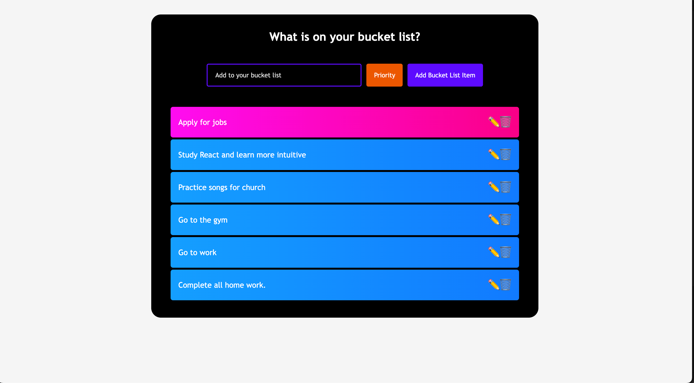

# React: Bucket list

This project invites you to use most of the concepts you've learned in this module. You will manage state using the `useState` Hook, pass data as props to child components, and use lists and keys to render a list of bucket-list items.

## Activity

Work with your group to resolve the following issues:

* As a user, I want to be able to able to enter a bucket-list item.

* As a user, I want to be able to set the eagerness level of a bucket-list item.

* As a user, I want to see a list of all my bucket-list items after they are added, with colors that identify their eagerness level.

* As a user, I want to be able to edit and delete bucket-list items.

## Screenshot of final Page

